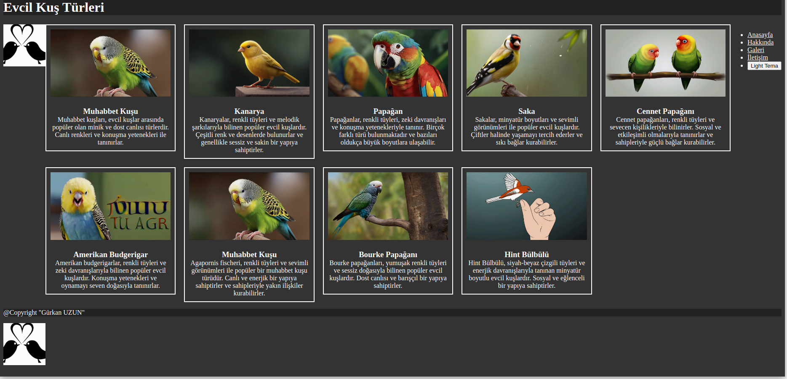

# Portfolio / Galeri Web Sitesi

> References :
>> Global AI Hub

  

Bu projede, yapay zeka araçlarını kullanarak üreteceğiniz görsel ve metinleri, yine bu
araçlar yardımıyla geliştireceğiniz HTML tabanlı bir web sitesinde sergilemeniz
beklenmektedir.

## Örnek Araçlar
- **Canva:** Görsel içeriklerin tasarlanması için kullanılabilecek bir platform.
- **DALL-E:** Yaratıcı görsel içeriklerin oluşturulması için kullanılabilecek bir yapay zeka modeli.
- **Artbreeder:** Fotoğraf ve görsellerin birleştirilmesi ve manipülasyonu ile yeni sanat eserleri
üretmek için kullanılabilecek bir platform.
- **DeepDream:** Görsellerin halüsinasyon benzeri manipülasyonları için kullanılabilecek bir
yapay zeka aracı.
- **Bard, CopyWrite, ChatGPT:** Metin içeriklerinin üretilmesi için kullanılabilecek yapay zeka
tabanlı araçlar.

Not: Bu araçların kullanılması zorunlu değildir, fikir edindirmek için verilmiştir. Katılımcılar
diledikleri GPT asistan(lar)ını kullanarak bu projeyi gerçekleştirebilir.

### 1) Web Sitesinin Yapay Zeka ile Oluşturulması:
Web sitesinin yapay zeka araçları kullanılarak prompt'larla oluşturulması ve bu prompt'ların
proje klasöründe yer alması gerekmektedir.
Not: HTML&CSS gerekli ve yeterlidir, Javascript benzeri teknolojileri de opsiyonel olarak
kullanabilirsiniz.

### 2) Yapay Zeka ile Oluşturulan İçerikler:
Proje içerisinde en az bir görsel ve bir içeriğin yapay zeka araçları ile oluşturulması zorunludur. Bu içeriklerin üretiminde kullanılan prompt'ların proje klasöründe yer alması gerekmektedir.

### 3) Semantik Etiketlerin Kullanılması:
Web sitesinin HTML yapısında, semantik etiketlerin (header, main, nav, section, article, aside, footer) kullanılması beklenmektedir.

### 4) Responsive Tasarım (Opsiyonel):
Oluşturulan web sitesi, farklı cihaz ve ekran boyutlarına uyumlu olmalıdır. Mobil, tablet ve masaüstü cihazlarda düzgün bir şekilde görüntülenmeli ve kullanıcı deneyimini artırmak için tasarımın her boyutu optimize edilmiş olmalıdır.
